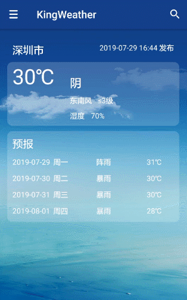

# KingWeather

KingWeather 是基于[MVVMFrame](https://github.com/jenly1314/MVVMFrame)快速开发框架构建的一个简单的天气预报APP。主要用于练手并熟悉Kotlin的基本语法

## 效果展示

> 你也可以直接 [下载App](https://raw.githubusercontent.com/jenly1314/KingWeather/master/app/release/app-release.apk) 体验效果

## 版本日志

#### 2019-7-29    v1.0    初始版本
*  初始版本

## 相关推荐
- [MVVMFrame](https://github.com/jenly1314/MVVMFrame) 一个基于Google官方推出的JetPack构建的MVVM快速开发框架。
- [AppTemplate](https://github.com/jenly1314/AppTemplate) 一款基于 MVVMFrame 构建的App模板。
- [AppUpdater](http://github.com/jenly1314/AppUpdater) 一个专注于App更新，一键傻瓜式集成App版本升级的轻量开源库。
- [RetrofitHelper](http://github.com/jenly1314/RetrofitHelper) 一个支持动态改变BaseUrl，动态配置超时时长的Retrofit帮助类。
- [BaseUrlManager](http://github.com/jenly1314/BaseUrlManager) 一个BaseUrl管理器，主要用于打测试包时，一个App可动态切换到不同的开发环境或测试环境。
- [SuperTextView](http://github.com/jenly1314/SuperTextView) 一个在TextView的基础上扩展了几种动画效果的控件。
- [ImageViewer](http://github.com/AndroidKTX/ImageViewer) 一个图片查看器，一般用来查看图片详情或查看大图时使用。
- [GuidePage](http://github.com/AndroidKTX/GuidePage) 一个App欢迎引导页。一般用于首次打开App时场景，通过引导页指南，概述App特色等相关信息。
- [LogX](http://github.com/jenly1314/LogX) 一个轻量而强大的日志框架；好用不解释。
- [KVCache](http://github.com/jenly1314/KVCache) 一个便于统一管理的键值缓存库；支持无缝切换缓存实现。
- [AndroidKTX](http://github.com/AndroidKTX/AndroidKTX) 一个简化 Android 开发的 Kotlin 工具类集合。
- [AndroidUtil](http://github.com/AndroidUtil/AndroidUtil) 一个整理了Android常用工具类集合，平时在开发的过程中可能会经常用到。

---

